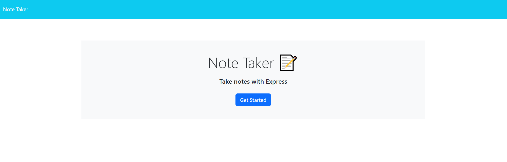
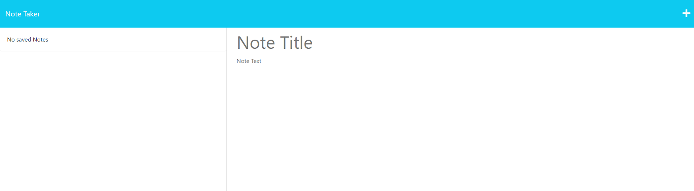
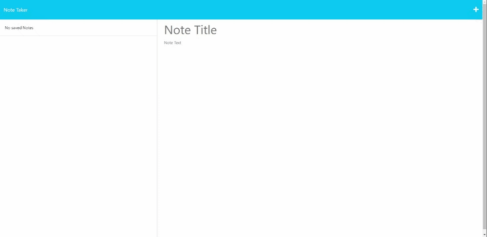
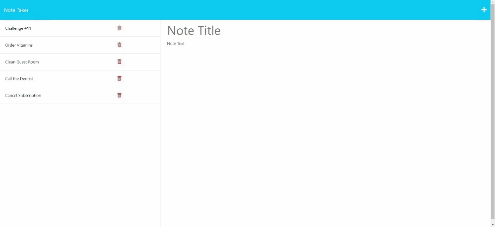
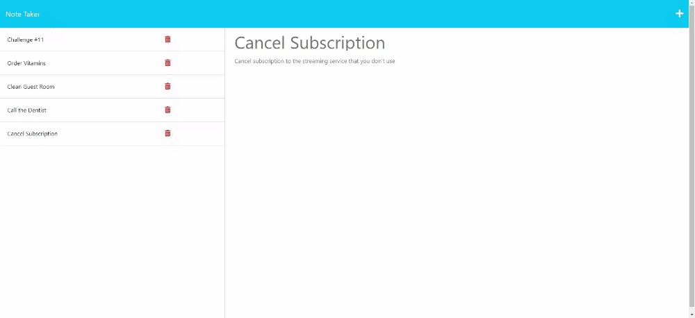

# Note Taker

## Description

In this project, I worked with existing code provided by The Coding Bootcamp on GitLab. I was motivated to add a server.js file to the existing code to direct and store information provided by user inputs into the db.json file.

This website was created for the purpose of giving the user a place to keep organized by having a single location that they can keep notes. It provides the opportunity to write in messages that can be saved to the json file instead of stored locally.

Through the process of coding the password generator in JavaScript, I was able to learn more about express GET, POST, and DELETE as well as how to use express to link html files.

[Here is a link to the webpage](https://quiet-escarpment-54550-d9ecd6b39784.herokuapp.com/).

---
---

## Table of Contents

- [Starting Code](#starting-code)
- [Usage](#usage)
- [Credits](#credits)
- [License](#license)

---
---

## Starting Code

The key to this project was to add express in a server.js file to create functionality to the existing HTML and CSS and javascript files. Below is the image of the code before. As you can see visually, there are interactive parts to the code that have no function without linking the HTML files and the db.json file. With the new code, the information stored in the file will appear on the left-hand side of the notes page and there will be the ability to add to an review that information.

---

## Usage

The final website for the Note Taker allows for the landing page functionality to link to the note page. From the notes page, there will be a list of notes previously added on the left-hand side of the page. The main section allows new notes to be added, and the trash can symbol allows notes to be deleted. These notes will be added and deleted from the db.json file and will keep that information the same.

### New Note

### View Note

### Delete Note

---

## Credits
Starter code from this gitLab repository: https://git.bootcampcontent.com/University-of-Denver/DU-VIRT-FSF-PT-04-2023-U-LOLC/-/tree/main/11-Express/02-Challenge

The Coding Bootcamp repositories for Boot Camp Curriculum Lesson Plans: https://github.com/coding-boot-camp

My TA, Andrew Stehno

Helpful Resources:
W3 School’s information about JavaScript: https://www.w3schools.com/js/default.asp
Stack Overflow’s answered questions about JavaScript: https://stackoverflow.com/
MDN’s information on JavaScript: https://developer.mozilla.org/en-US/
Google.com helping me find the above resources

The README template I used was provided by The Full-Stack Blog: https://coding-boot-camp.github.io/full-stack/github/professional-readme-guide

---

## License
MIT Licence